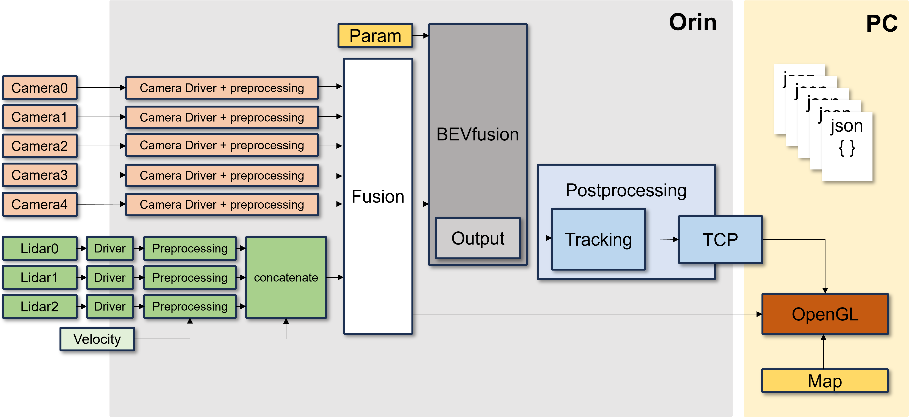

# BEVfusion_demo


## Abstract

This project is based on [BEVFusion](https://github.com/mit-han-lab/bevfusion). The version of BEVFusion using ROS2.

## Flow



## Usage

Dataset: [nuscenes ROS2 bag](https://drive.google.com/file/d/1OGmt05ZW1WbtR4Xy-vVhWRRuXZ5c2iGx/view?usp=drive_link)

### Requirements

- ROS2 (Foxy)
- Pytorch
- CUDA 11.4

### How to start

***Data Preparation***

This project is using the nuscenes dataset.

1. Create a `.pkl` file containing calibration results.
(Details [HERE](https://github.com/open-mmlab/mmdetection3d/blob/1.0/docs/en/datasets/nuscenes_det.md))

2. Create the `calibration_parameter.yaml` file using the `.pkl` file.
   - `sensor2lidar` rotation (3x3 matrix),
   - `sensor2lidar` translation (3x1 matrix),
   - Intrinsic matrix (3x3 matrix)

3. Create four 4x4 matrices below and update the `calibration_parameter.yaml` file.
   Format:
   
    - 6 camera intrinsic 4x4 matrices
        - Rotation: camera intrinsic matrix
        - Translation: zero matrix
        
    - 6 camera2lidar 4x4 matrices
        - Rotation: `sensor2lidar` rotation matrix
        - Translation: `sensor2lidar` translation matrix
        
    - 6 lidar2camera 4x4 matrices
        - Rotation: Transformation of `sensor2lidar` rotation matrix
        - Translation: Convolution of Transformation `sensor2lidar` translation and `sensor2lidar` rotation matrix
        
    - 6 lidar2image 4x4 matrices
        - Using the file `./tools/lidar2image.py`
            - Input: The `calibration_parameter.yaml` file which has the information of the 3 matrices above.
            - Output: The lidar2image 4x4 matrix
        - Add this output matrix to the `calibration_parameter.yaml` file which is used as input

4. Convert to a `.bag` file using [nuscenes2bag](https://github.com/clynamen/nuscenes2bag).
    > This converts the nuscenes dataset to a ROS1 bag file, so you have to convert it to ROS2 format.
    > We used the library [rosbag_convert](https://ternaris.gitlab.io/rosbags/topics/convert.html)

***Run***

```Shell
torchpack dist-run -np 1 python tools/BEVfusion_exe.py
```

## Detail

We have several points of upgrade from the original BEVfusion.

***Number of Sensors***

> Multiple Cameras & Multiple Lidars
> We have a preprocessing module because of using **3 Lidars** and **6 Cameras**.
> However, this repository is the ***DEMO*** version of our project, so we are using **1 Lidar** and **1 Camera**.

***Lidar Preprocessing***

> Details: [Preprocessing_module](https://github.com/newintelligence4/BEVfusion_preprocess) branch `1Lidar`

***Differences***

Original BEVfusion:

> Using a **static** Dataset
> - Large amount of data
> - Calibrating all sensors with their own ego_frame (IMU)
> - No Tracking ID
> - Object detection using Map information inside the model's own map segmentation

BEVfusion with ROS2:

> Using a **Realtime** Dataset
> - It is necessary to manage data efficiently when using realtime data
>   -> Reduce the data size by preprocessing sensor's raw data
> - Remove the IMU dependency for ego_frame (IMU)
> - Direct Calibration of Camera to Lidar and transform to Model as parameter type (`.yaml`)
> - Add detected object's own ID using 2D Object Tracking (`SORT` Algorithm) in the Bird's-eye view plane
> - Remove the *map segmentation* part, and visualize object's information using the *HD map*

## Results


## Team

| Name       | Mail                  | Role              | Github            |
|------------|-----------------------|-------------------|-------------------|
| 임승휘     | iish613613@gmail.com | Model Transform </br> Build Orin </br> General Manager | @SeungHwi0613    |
| 신지혜     | jshin0404@gmail.com | Lidar Preprocessing | @NewIntelligence4 |
| 장재현     | wogus5216@gmail.com | Postprocessing     | @JaehyunJang5216 |
